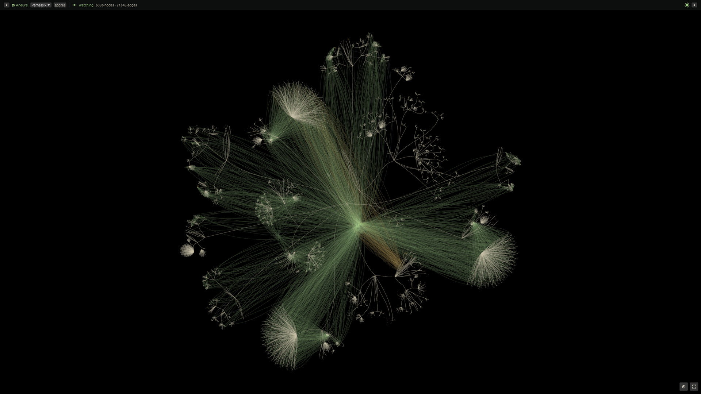
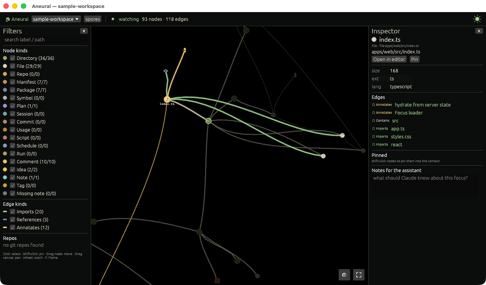
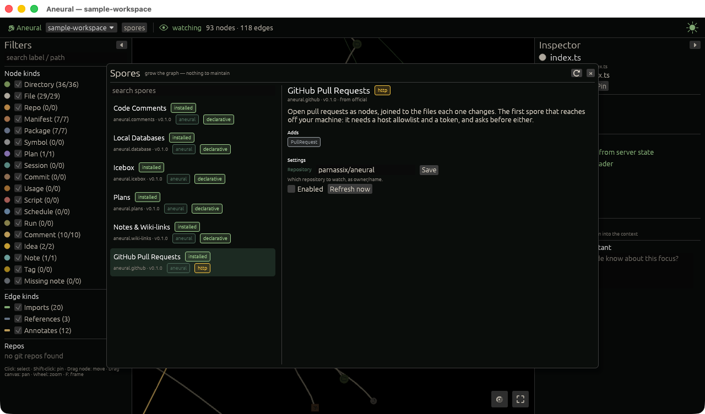
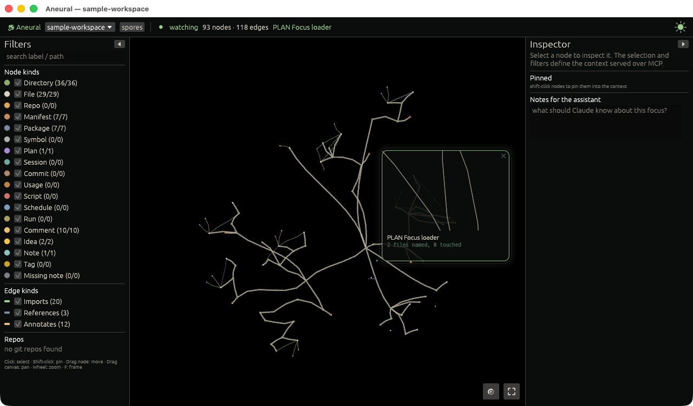
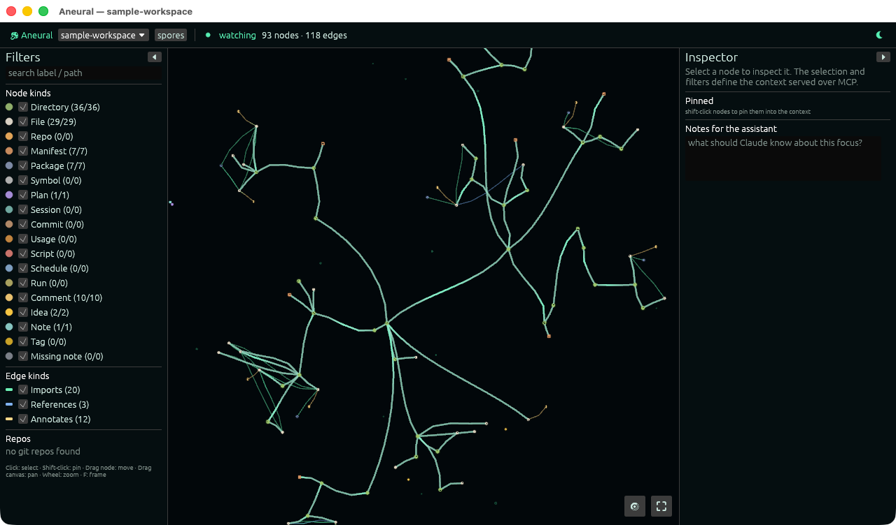

<h1 align="center">Aneural</h1>

<p align="center">
  <strong>A living map of everything you're building.</strong><br>
  Point it at a directory and it grows into a mycelium of files, folders, packages, plans and notes,<br>
  stays current as you work, and hands the part you're looking at to your coding assistant.
</p>

<p align="center">
  
</p>
<p align="center"><sub>A workspace of twelve repositories: 6,036 nodes, 21,643 edges. Every strand is something real on disk.</sub></p>

---

Aneural is three things that share one index:

| | |
|---|---|
| **A desktop app** (`aneural-gui`, Rust + Bevy) | Draws any directory as a 2D graph of typed nodes and typed edges, and keeps growing it as files change. |
| **A CLI** (`aneural`, TypeScript) | `init`, `index`, `query`, `neighbors`, `focus`, `spores`, `doctor`, `mcp`. |
| **An MCP server** (`aneural mcp`) | Serves exactly what you have selected and filtered in the app to Claude Code, Codex or any MCP client. |

Nothing is uploaded and nothing is generated. Every node is inferred from a file you already have.

## Contents

- [What it does](#what-it-does)
- [Run it locally](#run-it-locally)
- [Use it on your own project](#use-it-on-your-own-project)
- [Configuration](#configuration)
- [Privacy and safety](#privacy-and-safety)
- [Repository layout](#repository-layout)
- [Development](#development)

## What it does

### A graph that looks like what it is

Folders are clusters, files grow from their folder, and everything grows outward from the root, so a
branch never folds back across another. The folder tree is drawn as thick pale strands; imports,
references and annotations are thin until you select something. The layout is computed, not
simulated, and it only ever rearranges when you ask (`Space`).

Imports are resolved for TypeScript and JavaScript (tsconfig paths, `exports` maps, `.js`→`.ts`) and
extracted with best-effort resolution for Python, Rust, Go, Java, PHP and Ruby. External
dependencies appear as `Package` nodes because a file imports them, not because a manifest lists them.

### Select something, and that is the context

<p align="center">
  
</p>

Click a node and its neighbourhood lights while the rest dims. The inspector shows its properties
and every edge by kind, with **Open in editor** and **Pin**. Shift-click pins more nodes, and a
free-text box holds notes for the assistant.

That selection, the active filters and the notes are written to `.aneural/state/focus.json`.
`aneural mcp` serves that neighbourhood (nodes, edges and file contents) so your assistant starts
from what you are looking at instead of from the whole repository.

### Spores: lightweight, inferred, nothing to maintain

<p align="center">
  
</p>

A spore is a JSON manifest that declares node types and *harvesters* (`regex`, `tree-sitter`,
`markdown`, `sqlite`, `http`) run by built-in Rust runners. A spore ships no code, so nothing a
spore ships is ever executed.

| Spore | What it adds | On by default |
|---|---|---|
| `aneural.comments` | `TODO` / `FIXME` / `HACK` / `NOTE` and `claude:` comments as nodes on the file they sit in | yes |
| `aneural.plans` | Plan documents as nodes annotating the files they target | yes |
| `aneural.icebox` | Every `## heading` in `.aneural/icebox/*.md` as an Idea | yes |
| `aneural.wiki-links` | Notes, `[[wiki links]]`, frontmatter tags, and links to notes nobody has written yet | yes |
| `aneural.database` | Tables, columns and foreign keys of SQLite databases in the workspace | no |
| `aneural.scripts` | Runnable scripts, and the schedules declared for them in crontabs and CI workflows | no |
| `aneural.github` | Open pull requests joined to the files each one changes | no (needs a token) |

The marketplace is a modal in the app (the **spores** button) and `aneural spores …` on the command
line. Each spore's tier is *derived* from the capabilities it declares, so it cannot understate what
it will do: `declarative` reads files, `http` may call named public hosts with a named secret, and
anything that would need a sandbox or native privileges lists but refuses to install. See
[docs/marketplace.md](docs/marketplace.md).

### History, plans and token usage (opt-in)

With `history.git` (on by default) each repository's commits become nodes joined to the files they
changed. With `history.claude` (off by default) so do your Claude Code sessions and approved plans
for this workspace, which lets the app show a plan against what became of it: files it named and
touched, named and skipped, and touched without being named. Session, plan and per-repository
token totals are kept split by model and by token class; nothing carries a price.

### Live: what is happening on this machine right now

<p align="center">
  
</p>

When a plan is approved, a commit lands, a batch of files changes or a script starts running, the
nodes involved glow and a **portal** opens: a small second camera onto that corner of the graph.
The view you arranged never moves on its own; clicking the portal is how you go there. A signal that
names no node on the canvas is never raised. `gui.live: false` switches the whole layer off.

### It keeps your hours

<p align="center">
  
</p>

By day the app is a plain tool. Through the evening the palette cools, halos light and pulses travel
the strands. `gui.circadian` (`auto` | `day` | `night`) pins it, and the dial in the top bar cycles
the same three for the session.

## Run it locally

### Prerequisites

| | Version | Notes |
|---|---|---|
| Rust | stable, 1.95 or newer | Install with [rustup](https://rustup.rs); `rust-toolchain.toml` selects the channel. |
| Node.js | 22.12 or newer | Only needed for the CLI and MCP server. |
| pnpm | 12 | `corepack enable` picks up the version pinned in `package.json`. |
| C toolchain | | macOS: `xcode-select --install`. Linux: see below. |

Linux needs the windowing and audio headers Bevy links against:

```sh
sudo apt-get install -y libasound2-dev libudev-dev libwayland-dev libxkbcommon-dev
```

macOS is the primary development platform. CI builds and tests the Rust workspace on macOS and
Linux. Reading installed schedules (`runs.enabled`) is macOS-only because it reads launchd.

### The app

```sh
git clone https://github.com/Parnassix/aneural.git
cd aneural
cargo run -p aneural-gui --features dev -- fixtures/sample-workspace
```

The first build compiles Bevy and takes several minutes; later builds take seconds. Omit the path
to get a folder picker. `--features dev` links Bevy dynamically for fast rebuilds; leave it off for
a self-contained binary (`cargo build --release -p aneural-gui`).

| Input | Action |
|---|---|
| Click / Shift-click | Select / pin into the context |
| Drag a node | Move it, and its branch with it |
| Drag the canvas, arrows, `WASD` | Pan |
| Wheel or pinch | Zoom to the cursor |
| `F` | Frame the whole graph |
| `Space` | Lay the graph out afresh |
| `R` | Reindex |

On macOS, `scripts/bundle-macos.sh` builds `Aneural.app`, signs it ad hoc and installs it to
`/Applications` (`--no-install` leaves it in `target/`, `--to <dir>` installs elsewhere).

### The CLI and MCP server

```sh
pnpm install
pnpm build:native        # compiles the Rust addon (@aneural/core) for this machine
pnpm -r build            # builds the CLI and the MCP server
```

Put the CLI on your `PATH` (any directory on it will do):

```sh
ln -s "$PWD/packages/cli/dist/cli.js" ~/.local/bin/aneural
```

Then try it on the sample workspace:

```sh
cd fixtures/sample-workspace
aneural index
aneural query util
aneural neighbors file:apps/web/src/index.ts
aneural doctor
```

## Use it on your own project

```sh
cd ~/code/my-project
aneural init --claude     # creates .aneural/ and registers the MCP server in .mcp.json
aneural index
```

Then open it in the app: `aneural open` if `aneural-gui` is on your `PATH`, the installed
`Aneural.app`, or `cargo run -p aneural-gui --features dev -- ~/code/my-project` from this checkout.

`init` creates an Obsidian-style `.aneural/` directory:

```
.aneural/
  config.json     committed   what to index, which spores are on
  notes/          committed   markdown notes; [[wiki links]] become edges
  plans/          committed   plan documents with a `targets:` list
  icebox/         committed   ideas, one per `## heading`
  nodes/          committed   your own node kinds (icon, colour, shape)
  cache/          ignored     the SQLite index; delete it and it is rebuilt
  state/          ignored     focus.json, the context handed to MCP clients
```

`--claude` writes this to `.mcp.json`, so Claude Code starts the server from the CLI on your `PATH`:

```json
{ "mcpServers": { "aneural": { "command": "aneural", "args": ["mcp"] } } }
```

`aneural init --codex` prints the equivalent `~/.codex/config.toml` snippet. The server exposes
`aneural_focus`, `aneural_search_nodes`, `aneural_get_node`, `aneural_neighborhood`,
`aneural_get_edges`, `aneural_read_file`, `aneural_list_node_types`, `aneural_list_spores`,
`aneural_counts`, `aneural_doctor`, `aneural_index` and `aneural_add_idea`, plus an
`aneural://focus` resource that updates when the selection changes.

## Configuration

Everything lives in `.aneural/config.json`. Every key is optional.

| Key | Default | What it does |
|---|---|---|
| `roots` | `["."]` | Directories to index, relative to the workspace. |
| `respectGitignore` | `true` | Skip whatever git ignores. |
| `ignore` | `node_modules`, `target`, `dist`, … | Extra globs to skip. |
| `languages` | all eight | Which analysers run. |
| `spores.enabled` | the four default spores | Which spores harvest. |
| `spores.registries` | the official registry | Where the marketplace looks. |
| `history.git` | `true` | Commits as nodes. |
| `history.claude` | `false` | Claude Code sessions and plans for this workspace as nodes. |
| `history.claudePrompts` | `false` | Keep the text of what you typed on session nodes. |
| `runs.enabled` | `false` | Read installed launch agents and work out what is due (macOS). |
| `gui.circadian` | `auto` | `auto`, `day` or `night`. |
| `gui.live` | `true` | The live layer: glows and portals. |
| `gui.portals` | `3` | How many portals may be open; `0` keeps the glow only. |
| `gui.livePace` | `auto` | `auto`, `eager`, `calm` or `off`: how often the machine is sampled. |
| `gui.labelZoomThreshold` | `0.8` | How far in you zoom before labels appear. |

### Where the window opens

This is a preference about your desk, not about a workspace, so it lives in your user config
directory and is never committed. Create `~/.config/aneural/window.json`:

```json
{ "monitor": "2560x1440", "fullscreen": true }
```

`monitor` is matched, ignoring case, anywhere in `<name> <width>x<height>`. On macOS the name is
`Monitor #<model number>` rather than the words on the bezel, so the size is often the easier thing
to match. If no connected monitor matches, the app logs the labels it can see and opens on whichever
screen the system chose, still full screen if you asked for that.

## Privacy and safety

Aneural is a local tool. This section is the whole list of what it touches.

**What it reads**

- The directory you open, honouring `.gitignore` and `ignore`. File reads over MCP are confined to
  that directory; a path that escapes it is refused.
- Each repository's git history (`history.git`). The git reader is compiled without any network
  client.
- **Only if you turn it on:** `~/.claude` for this workspace's sessions and plans
  (`history.claude`), and `~/Library/LaunchAgents` plus `launchctl list` (`runs.enabled`). Both
  default to off, and that default is the consent.
- The live layer samples `ps` and `~/.claude/sessions/` to see which sessions and scripts are
  running. A portal's caption shows the program, elapsed time, pids and memory, never the command
  line. Nothing sampled is stored. `gui.live: false` turns it off.

**What leaves your machine**

- By default, one request: the app and `aneural spores` fetch the marketplace index from
  `raw.githubusercontent.com`. Installing a spore downloads its manifest from the repository the
  listing pins and verifies it against a SHA-256.
- An `http` spore you install *and* enable calls only the public hosts its manifest lists.
  Redirects to another host are refused, and `localhost`, IP literals and internal names cannot be
  listed.
- Indexing and the MCP server never make a network request. They do not link a TLS stack at all.

There is no telemetry, no account and no server.

**Secrets**

Credentials are read from the environment only, as `ANEURAL_SECRET_<NAME>` (for example
`ANEURAL_SECRET_GITHUB_TOKEN`). Aneural never writes one to disk, and a manifest that puts a secret
in a URL is rejected, because URLs are logged and cached. *Settings* (which repository to watch) are
committed; *secrets* never are.

**What ends up in git**

- `.aneural/cache/` and `.aneural/state/` are ignored by a `.aneural/.gitignore` that Aneural writes
  the first time it touches a directory, whether or not you ran `init`. The cache can hold session
  titles and token counts when `history.claude` is on, so do not remove that rule.
- With `runs.enabled`, the run journal in `.aneural/runs/` is **designed to be committed** so run
  history merges across machines. It records the machine name, the command and working directory,
  and the last lines of a job's output. Read it before you push to a public repository.
- `history.claudePrompts` puts what you typed within reach of anything that reads the focus over
  MCP. Leave it off unless you want that.

**What it runs**

Nothing from a spore, ever. The app starts `ps` for the live layer, `launchctl list` and `hostname`
only with `runs.enabled`, and your `$VISUAL` / `$EDITOR` when you click **Open in editor**.

To report a vulnerability, use
[private vulnerability reporting](https://github.com/Parnassix/aneural/security/advisories/new)
rather than a public issue.

## Repository layout

```
crates/aneural-core       graph model, ids, .aneural config / focus / spore schemas (no IO beyond the workspace)
crates/aneural-store      SQLite index (.aneural/cache/index.db)
crates/aneural-lang       tree-sitter import extraction and module resolution
crates/aneural-engine     walker, watcher, spore harvesters, history and run producers → GraphDelta stream
crates/aneural-git        read-only git history (gix, no network)
crates/aneural-registry   marketplace client: the only crate that reaches the network
crates/aneural-icons      curated icondata registry and rasteriser
crates/aneural-napi       Node addon → packages/core
crates/aneural-gui        the Bevy desktop app
packages/core             @aneural/core (napi bindings)
packages/cli              aneural (CLI)
packages/mcp              @aneural/mcp (MCP server)
spores/                   first-party spores
registry/                 the official marketplace index and publisher terms
fixtures/sample-workspace multi-language demo and test workspace
```

Design notes: [architecture](docs/architecture.md) · [graph schema](docs/graph-schema.md) ·
[spores](docs/spores.md) · [marketplace](docs/marketplace.md) · [GUI](docs/gui.md) ·
[addon API](docs/napi-api.md)

## Development

```sh
cargo fmt --all --check
cargo clippy --workspace --exclude aneural-gui --all-targets -- -D warnings
cargo test --workspace --exclude aneural-gui     # everything but the Bevy crate; fast
cargo test -p aneural-gui                        # layout, live probe, window placement

pnpm lint
pnpm -r typecheck
pnpm -r test                                     # CLI and MCP server
```

No test touches the network, your `~/.claude` or your launch agents: every producer that reads
outside the workspace takes an injectable root, and every HTTP harvester test injects a fake
fetcher.

`cargo run -p aneural-engine --example tally -- <dir>` prints token totals by workspace, repository
and plan without opening the app.

## License

MIT OR Apache-2.0 for the Rust crates and MIT for the npm packages, as declared in their manifests.
